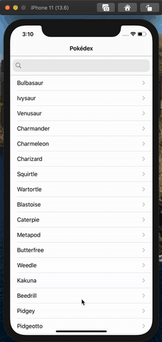

# Pokedex

iOS Track for CS50x

This is a basic Pokédex app that allows users to search for the first 151 Pokémon. The <code>pokeapi.co</code> API was used to fetch the Pokémon images, descriptions, and other information. The Pokédex keeps track of the Pokémon that have been caught using a button feature which has an option to release the Pokémon as well.

# Demo

